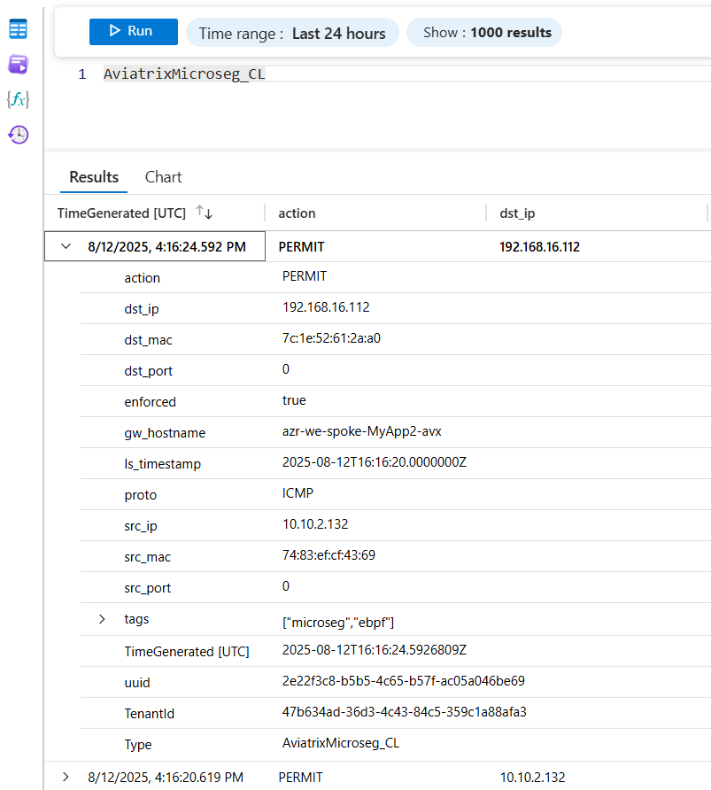
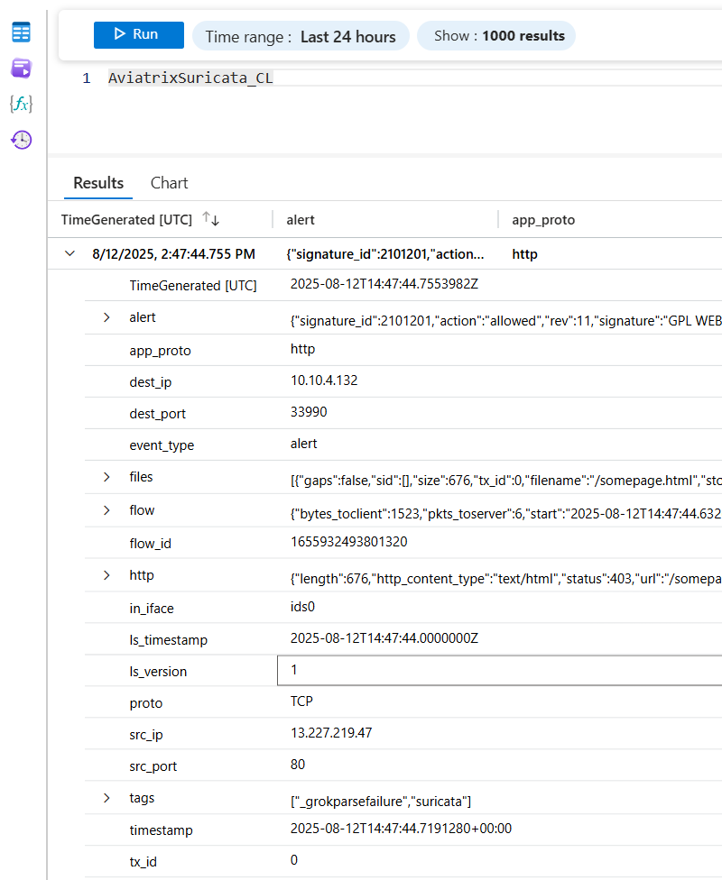

# Azure Container Instances (ACI) Logstash Deployment

This Terraform configuration deploys a Logstash container on Azure Container Instances (ACI) with the following specifications:

## Configuration Details

- **Location**: Provide any preferred Azure region
- **Container Image**: aviatrixacr.azurecr.io/aviatrix-logstash-sentinel
  - This is a custom image built with the Azure Log Ingestion API plugin. You can built your own following [README](logstash-container-build/README.md) into the logstash-container-builder folder. Update your terraform.tfvars file accordingly.
- **Resources**: 1 vCPU, 1.5GB memory
  - You can adapt to the expected load on your container.
  - You can also add more containers to the container group if needed updating the "container_count" variable.
- **Network**: Public IP with TCP port 5000 exposed.
  - You can use UDP for higher performance by updating "container_protocol" variable.
- **OS Type**: Linux
- **Storage**: Azure File Shares mounted at `/usr/share/logstash/pipeline` and `/usr/share/logstash/patterns` for configuration and pattern files
- **Logging**: Provide your own Lag Analytcis workspace's name and resource group using log_analytics_workspace_name and log_analytics_resource_group_name variables.

## Prerequisites

1. Azure CLI installed and authenticated
2. Terraform >= 1.0 installed
3. Existing Log Analytics workspace and resource group information
4. Azure Service Principal (aka. Application) to be used by logstash plugin to push data to Log Analytics
4. Custom container containing logstash and sentinel plugin (actual source here is supplied as best effort, you should build/use your source)
5. Log Analytics Custom Log tables for Microseg and Suricata logs. Info below
    - Corresponding Azure Monitor Data Collection Rules and Data Collection Endpoint are created by the azure-drc.tf TF configuration file.

## Deployment Steps

This is a first release that mixes Terraform code along with some Azure CLI commands as not everything was available in Terraform.

### Azure part

#### EntraID Application creation

```bash
az ad sp create-for-rbac --name "<your-application-name>"
```
Keep application id and application secret for use in terraform.tfvars and for role assignment at the end of that readme.

#### Custom log table creation example (not available through Terraform azurerm provider yet)

```bash
az monitor log-analytics workspace table create \
    --resource-group <your-resource-group-name> \
    --workspace-name <your-log-analytics-workspace-name> \
    --name "AviatrixMicroseg_CL" \
    --columns TimeGenerated=datetime action=string dst_ip=string dst_mac=string dst_port=int \
    enforced=boolean gw_hostname=string ls_timestamp=string proto=string src_ip=string src_mac=string \
    src_port=int tags=dynamic uuid=string
```
```bash
az monitor log-analytics workspace table create \
   --resource-group <your-resource-group-name> \
   --workspace-name <your-log-analytics-workspace-name> \
   --name "AviatrixSuricata_CL" \
   --columns TimeGenerated=datetime Computer=string alert=dynamic app_proto=string dest_ip=string dest_port=int event_type=string files=dynamic flow=dynamic flow_id=long http=dynamic in_iface=string ls_timestamp=string ls_version=string proto=string src_ip=string src_port=int tags=dynamic timestamp=string tx_id=int
```

### Terraform part

From within the deployment-tf\azure-aci folder, run the below:

1. **Initialize Terraform**:
   ```bash
   terraform init
   ```

2. **Review the plan**:
   ```bash
   terraform plan -var-file="terraform.tfvars"
   ```

3. **Apply the configuration**:
   ```bash
   terraform apply -var-file="terraform.tfvars"
   ```

4. **Get outputs**:
   ```bash
   terraform output
   ```

## Configuration Files

- `main.tf` - Main Terraform configuration
- `variables.tf` - Variable definitions
- `outputs.tf` - Output definitions
- `terraform.tfvars.sample` - Sample variable file (customize as needed)
- `azure-dcr.tf` - Azure Data Collection Rules and endpoints configuration

## Customization

You can customize the deployment by creating your own `terraform.tfvars.sample` file naming it `terraform.tfvars` for automated pickup.

- Change resource names
- Modify container specifications
- Add additional environment variables
- Update tags
- ...

## Accessing Logstash

After deployment, Logstash will be accessible at:
- **FQDN**: The output `container_group_fqdn` will provide the full domain name. That is what needs to be used to configure an additional  Copilot remote logging profil in addition to the one for Copilot. (Steps given below.)

You can also attach to container to read ouput easily:
```bash
# Attach to the running Logstash container in ACI
az container attach \
   --resource-group <your-resource-group> \
   --name <your-container-group-name>
```
Replace `<your-resource-group>` and `<your-container-group-name>` with your actual resource group and container group names.

## Logstash Configuration

The deployment automatically uploads the following configuration files to the Azure File Share:

- **Main Configuration**: `logstash.conf` (from `../../logstash-configs/output_azure_log_ingestion_api/logstash_output_azure_lia.conf`)
- **Patterns**: `patterns/avx.conf` (from `../../logstash-configs/base_config/patterns/avx.conf`)

These files are mounted to the container at `/usr/share/logstash/pipeline` and `/usr/share/logstash/patterns` respectively.

If you decide to change any configuration, container is configured for auto reload of configuration using the variable "CONFIG_RELOAD_AUTOMATIC" = "true"

### Environment Variables Required

The Logstash configuration expects the following configuration variables for Azure Log Ingestion API integration:

You can set these in the `logstash_config_variables` in your `terraform.tfvars` using example from `terraform.tfvars.sample`.

## Clean Up

To destroy the resources:
```bash
terraform destroy
```
## Log Analytics output examples

Below are sample screenshots of Log Analytics queries and dashboards using data ingested from Logstash:

### Microseg Log Table Example



### Suricata Log Table Example



## Aviatrix Log export configuration

Configure Aviatrix Copilot to export logs to the newly deployed Azure Container Instance containing Logstash.
### Aviatrix Copilot Log Export Configuration

To export logs from Aviatrix Copilot to the Azure Container Instance running Logstash, follow these steps:

1. **Access Copilot UI**: Log in to your Aviatrix Copilot dashboard.
2. **Navigate to Log Export Settings**: Go to *Settings* > *Configuration* > *Logging services* > *Edit Profile* under Remote Syslog.
3. **Configure Syslog Export**:
   - **Profile**: Select a profile from 1 to 8 (not removing Copilot's profile)
   - **Profile Name**: Give it a name
   - **Server**: Use the `container_group_fqdn` output from Terraform.
   - **Port**: Set to `5000` (or your configured port).
   - **Protocol**: Select `TCP` (or `UDP` if configured).
4. **Save**: Save the configuration.

[See the Aviatrix Copilot documentation for more detailed instructions on configuring Syslog profiles.](https://docs.aviatrix.com/documentation/latest/platform-administration/copilot/aviatrix-logging-copilot.html#syslog-profiles)

Logs from Copilot will now be forwarded to Logstash in the Azure Container Instance for processing. Upon messages recognition, logs will be sent to Azure Log Analytics via the Azure Log Ingestion API.

### Role assignement to Application on Data Collection Rules to allow plugin to push data to Microsoft Log Ingestion API via DCR rule.

This is needed in order to allow the Service Principal (EntraID application) previously created and used by the Logstash plugin to send data to the two Data Collection Rules. They will in turn, send logs to the Log Analytics custom tables.
Please be sure to update the different parameters contained into < >

#### DCR IAM update for Suricata log ingestion
```bash
az role assignment create --assignee <your-application-id> --role "Monitoring Metrics Publisher" --scope /subscriptions/<your-subscription-id>/resourceGroups/<your-log-analytics-workspace-resource-group-name>/providers/Microsoft.Insights/dataCollectionRules/aviatrix-suricata-dcr
```

#### DCR IAM update for MicroSeg log ingestion
```bash
az role assignment create --assignee <your-application-id> --role "Monitoring Metrics Publisher" --scope /subscriptions/<your-subscription-id>/resourceGroups/<your-log-analytics-workspace-resource-group-name>/providers/Microsoft.Insights/dataCollectionRules/aviatrix-microseg-dcr
```